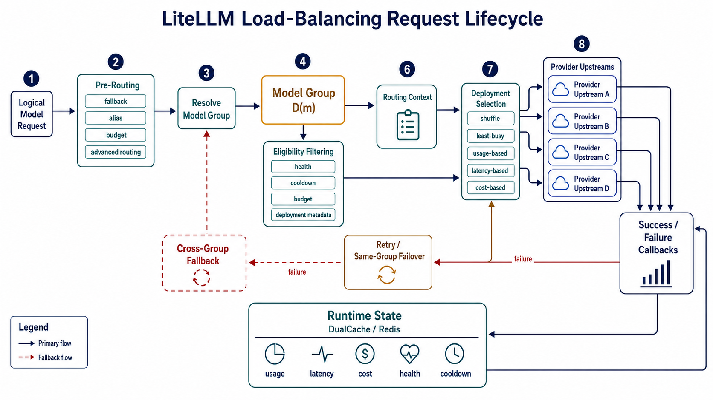

# LiteLLM Load Balancing: Technical Analysis

> An implementation-oriented analysis of LiteLLM's logical model groups, deployment selection strategies, runtime state, and failover behavior.

LiteLLM's Router separates the model name presented to an application from the provider endpoint that ultimately serves a request. A caller selects a logical model, while the Router resolves that name to a set of concrete deployments and chooses one eligible deployment for the current attempt. The load-balancing function is therefore a deployment-selection problem inside a model group, not a provider discovery mechanism and not, by itself, a model-quality decision.

The implementation is composed of several distinct controls. Model-group resolution defines the candidate domain, authorization and capability checks determine which deployments may serve the request, health and quota filters remove deployments that should not be attempted, and a routing strategy ranks or samples the remaining candidates. Success and failure callbacks then feed approximate runtime state back into later decisions. Retry and fallback operate around this selector: same-group failover changes the deployment, whereas cross-group fallback changes the logical model being attempted. Keeping these boundaries explicit is necessary for understanding both the available strategies and their operational consequences.

## Architecture Overview

## Contents

- [1. From Logical Model to Deployment](#1-from-logical-model-to-deployment)
- [2. Deployment Selection Strategies](#2-deployment-selection-strategies)
  - [2.1 Simple Shuffle](#21-simple-shuffle)
  - [2.2 Least Busy](#22-least-busy)
  - [2.3 Usage-Based Routing](#23-usage-based-routing)
  - [2.4 Latency-Based Routing](#24-latency-based-routing)
  - [2.5 Cost-Based Routing](#25-cost-based-routing)
- [3. Runtime State and Failure Handling](#3-runtime-state-and-failure-handling)
- [4. Model-Level Pre-Routing](#4-model-level-pre-routing)
- [5. Strategy Comparison](#5-strategy-comparison)

## 1. From Logical Model to Deployment

A model group is the set of deployments that share the same public `model_name`. When a caller requests `m`, LiteLLM finds the deployments in that group and selects one of them:

$$
D(m)=\{d_i\mid d_i.model\_name=m\}.
$$

The deployments in `D(m)` may use different providers, regions, credentials, or API endpoints, but they all serve the same logical model name. `model_name` is the Router's grouping key, while the provider-facing model identifier determines which model the upstream receives. The deployment ID identifies the individual upstream whose metrics, quota usage, health, and cooldown state are tracked. The caller therefore keeps using one stable name while the Router distributes requests across multiple upstreams.

`RoutingGroup` does not merge model groups or add more deployments. It assigns the same routing policy to several model names. Each name is still routed only within its own deployment set. In short, the model group answers **where LiteLLM can send the request**, while the routing group answers **which selection policy it should use**. Models not listed in an explicit routing group use the Router's default strategy.

Together, these abstractions define the request path. LiteLLM resolves the requested name, builds the deployment set for that model group, removes ineligible deployments, and applies the effective routing strategy. The selector never evaluates the entire configured model list; it receives only the eligible deployments for the current request.

The selection can be summarized as:

$$
C(m,q)=F(D(m),q),
\qquad
d^*=S_s(C(m,q)),
$$

where $F$ applies request and system filters, and $S_s$ applies the selected strategy.

| Stage | Router action | Result |
| --- | --- | --- |
| Model resolution | Resolve an alias, pattern, direct deployment ID, or default model | Logical model and deployment set $D(m)$ |
| Eligibility filtering | Apply access, capability, health, cooldown, budget, tag, order, and retry-exclusion rules | Eligible set $C(m,q)$ |
| Strategy resolution | Apply request-level override, routing-group policy, or Router default | Effective selector $S_s$ |
| Deployment selection | Run shuffle, least-busy, usage, latency, or cost routing | One selected deployment $d^*$ |
| Pre-call enforcement | Perform strategy-specific checks, such as usage v2 RPM reservation | Admitted call or local rate-limit error |
| Provider invocation | Translate the request and call the selected upstream | Response or provider exception |
| Feedback and recovery | Update runtime state, record failures, retry, or invoke fallback | Final response or terminal error |

Filtering and selection have different responsibilities. A budget filter removes deployments that are no longer allowed; it does not choose the cheapest remaining deployment. Health and cooldown remove endpoints that should not be attempted; the strategy then decides which eligible endpoint is preferable. Some strategies also perform a second check after selection. Usage v2, for example, reserves RPM capacity inside the request-concurrency boundary because a deployment can pass the initial read but lose a concurrent quota race.

After the provider call, callbacks update the state used by later requests, including usage, latency, cost, and in-flight counts. A failure may re-enter the same model group with the failed deployment excluded, or it may invoke a configured fallback model group. Same-group failover changes the upstream; cross-group fallback changes the logical model target. These recovery paths reuse the routing pipeline but are not themselves deployment-selection strategies.

## 2. Deployment Selection Strategies

LiteLLM's ordinary strategies optimize different observables. `simple-shuffle` optimizes distribution according to static weights, `least-busy` reacts to approximate concurrency, usage-based routing attempts to preserve provider RPM and TPM headroom, latency-based routing follows recent response measurements, and cost-based routing orders candidates by configured unit prices. These objectives are not interchangeable. A strategy can be locally correct for its own metric while still producing a poor system-level result when the dominant constraint lies elsewhere.

### 2.1 Simple Shuffle

`simple-shuffle` is the baseline selector and the default strategy for the implicit `default` routing group. Its unweighted form samples uniformly from the eligible deployments. If candidates have weights $w_i$ with a positive total, it performs weighted random selection:

$$
P(d_i)=\frac{w_i}{\sum_{j=1}^{n}w_j}.
$$

The implementation checks the candidate metadata in the order `weight`, `rpm`, and `tpm`. The first usable metric is treated as the sampling weight for the whole candidate list. If that metric has no positive total, the implementation proceeds to the next metric and ultimately falls back to uniform random choice. This makes the strategy a probability allocator rather than a deterministic scheduler. A deployment with twice the weight receives approximately twice the long-run share, but it can still receive adjacent requests and it is not guaranteed to receive exactly its proportional share in a short interval.

The strategy has no feedback loop. It does not read in-flight request counts, recent latency, current token consumption, or provider queue depth during selection. That absence is a feature when deployments are homogeneous and provider-side rate limiting is authoritative: selection is cheap, predictable, and independent of cache health. Static weights also provide a simple way to express capacity differences without adding an adaptive controller. The same property becomes a limitation when endpoints differ in transient load or reliability. A heavily queued deployment continues to receive its configured probability until health or cooldown filtering removes it.

The `rpm` and `tpm` fields used as shuffle weights should not be interpreted as hard local quota enforcement. They influence the probability of selection in this strategy. Hard eligibility is supplied by separate pre-call checks, callback filters, or a quota-aware selector such as usage-based routing. This distinction matters operationally because a deployment can be weighted by its nominal capacity while still encountering provider-side throttling if the configured limit is inaccurate or if several Router instances make concurrent decisions from stale state.

`simple-shuffle` is therefore the appropriate control-plane default for comparable endpoints, low state overhead, and deliberate static traffic shares. It is a poor fit when the primary objective is minimizing queueing, respecting tight per-deployment quotas, minimizing latency, or optimizing provider cost.

### 2.2 Least Busy

`least-busy` is a feedback strategy that attempts to steer a request toward the deployment with the smallest number of currently active requests. If $I(d)$ denotes the tracked in-flight count:

$$
d^*=\arg\min_{d\in C_{final}} I(d).
$$

The implementation realizes this objective through `LeastBusyLoggingHandler`. A pre-call callback increments the counter associated with the selected deployment ID. Success and failure callbacks decrement it when the request finishes. The counters are stored under a model-group-specific cache key, with deployment IDs as entries. Deployments not yet present in the cache are treated as having zero active requests, which gives new or recently added deployments an initially attractive state.

The strategy is useful when concurrency is the dominant source of contention. It reacts to the number of outstanding requests rather than waiting for completed-request statistics, so it can avoid an endpoint that is currently holding many long-running generations. It is especially relevant when request durations vary substantially and a random selector would send new work to an already saturated endpoint.

The counter is an estimate, not a scheduler-owned truth. The implementation updates a structured map through cache reads and writes rather than performing one globally serialized admission transaction. Callback loss, process termination, stale local cache entries, non-shared caches, and concurrent read-modify-write operations can all make the observed count diverge from actual concurrency. A failed decrement can leave an endpoint artificially busy; a duplicated or delayed callback can create the opposite error. The strategy also measures request count, not token volume, queue time, or provider-side work. Ten short requests and ten long generations contribute the same count even though their resource demand differs substantially.

`least-busy` should be selected when active concurrency is a better proxy for pressure than RPM, TPM, or latency. It should not be treated as a strict fairness guarantee, nor should its counters be used as billing or quota records. Shared Redis-backed state improves visibility across Router instances, but it does not eliminate the approximation introduced by callback timing and cache update semantics.

### 2.3 Usage-Based Routing

Usage-based routing addresses a different problem: provider limits are often expressed as requests per minute and tokens per minute, and a deployment that appears healthy can still be unusable if its remaining quota is insufficient for the next request. The strategy therefore combines a ranking objective with an admission test. For each deployment, the Router estimates the input-token demand and adds one request to the current RPM usage. Candidates that would cross their configured limits are excluded, and the selector prefers the candidate with the lowest observed TPM usage. Abstractly, a candidate is admitted only while:

$$
U_{tpm}(d)+\widehat{T}_{in}(q)\le L_{tpm}(d),
\qquad
U_{rpm}(d)+1\le L_{rpm}(d),
$$

where $U$ is locally observed usage, $\widehat{T}_{in}$ is the token estimate, and $L$ is the configured deployment limit. The exact boundary behavior follows the implementation's comparison operators; the important design point is that the current request is considered before selection rather than only after a response is logged.

The legacy `usage-based-routing` implementation stores TPM and RPM maps under keys composed primarily from the model group and the current minute. Successful-response callbacks add observed total tokens and one request to the deployment entry. At selection time, the Router reads the map, initializes unseen deployments at zero, estimates input tokens, removes candidates whose current-window usage would exceed their configured limits, and returns the lowest-TPM remaining deployment. The state update path is straightforward, but it is comparatively coarse. It relies on structured map reads and writes, records usage after successful responses, and ties the main cache object to the model group rather than making every counter an independently incremented deployment key.

The v2 implementation narrows the state scope and changes the concurrency model. Its cache keys include the deployment ID, provider-facing model, metric, and current minute. It reads the candidate TPM and RPM values in batches, filters by both quota dimensions, and randomly chooses among candidates tied for the lowest observed TPM. After selection, its RPM pre-call check runs inside the request-concurrency boundary. It first consults local state when possible, then performs an increment-aware check against the shared cache. A request that would exceed the configured RPM limit raises a rate-limit error before the provider call; successful callbacks increment TPM and RPM counters using cache increment operations. This design is intended to work across Router instances and reduces the race window that exists when multiple workers make quota decisions concurrently.

The v2 path is more appropriate for deployments with explicit and materially different RPM or TPM limits, especially when several Router instances share Redis. It is still not the provider's authoritative quota ledger. Input-token estimates can differ from provider tokenization, output tokens are known only after completion, minute boundaries create discontinuities, Redis failures can trigger a permissive fallback path, and provider-side quotas may include dimensions not represented in the local key. The selector should therefore be viewed as a local quota-preservation mechanism, not a proof that the next provider request will be accepted.

Usage-based routing is distinct from `simple-shuffle` weighting. A weight expresses a desired long-run traffic share; usage-based routing reacts to measured consumption and attempts to preserve remaining headroom. It is also distinct from budget limiting. Usage routing protects short-window provider capacity, while budget filtering protects an accumulated spending boundary. The two controls can be composed: budget filtering first removes deployments that are no longer allowed, and usage-based routing distributes traffic among the permitted remainder.

### 2.4 Latency-Based Routing

`latency-based-routing` uses recent observations to prefer deployments that have responded quickly. The implementation maintains a bounded history per deployment, normally with a maximum of ten samples and a default cache lifetime of approximately one hour. For non-streaming requests, it records response duration. For streaming requests, it can record time to first token, and the selector prefers the TTFT history when that history exists. When a model response includes usage data, the recorded duration may be normalized by completion-token count; otherwise the elapsed duration is retained directly. The strategy consequently optimizes LiteLLM's recorded metric, which may not be identical to raw end-to-end latency or a provider's internal service-time metric.

For deployment $d$ with observations $l_{d,1},\ldots,l_{d,k}$, the selection statistic is approximately:

$$
L(d)=\frac{1}{k}\sum_{j=1}^{k}l_{d,j}.
$$

The selector first removes candidates that fail current TPM or RPM checks, sorts the remaining deployments by the observed latency statistic, and identifies the minimum value $L_{min}$. It then forms a near-minimum set using `lowest_latency_buffer=b`:

$$
C_{near}=\{d\mid L(d)\le L_{min}+bL_{min}\}.
$$

Selection is random within $C_{near}$ rather than deterministic at the single minimum. The buffer provides limited exploration and prevents small measurement differences from concentrating all traffic on one deployment. With a zero buffer, the policy approaches minimum-latency selection; with a larger buffer, it trades some measured speed for distribution and resilience.

The feedback signal has several important biases. A bounded rolling sample reacts to recent conditions but can forget longer-term degradation. A deployment with few samples has a less reliable mean than one with a stable history, yet the selector does not perform a formal confidence calculation. Timeout failures are recorded with a large penalty, which pushes a deployment away from future choices without permanently excluding it. New deployments are initialized through the strategy's cache structure, so cold-start behavior should be validated against the deployed version rather than assumed to be statistically neutral. The metric also tends to favor fast completion for short responses even when a deployment has poor tail behavior under sustained load.

Latency routing is a good fit when user-perceived response time or streaming TTFT is the primary objective and the workload is sufficiently repetitive for samples to become meaningful. It should be combined with health, cooldown, and quota controls because a fast deployment can still be overloaded, rate-limited, or failing. It should not be described as a tail-latency optimizer: the current implementation uses bounded sample averages and a near-minimum buffer, not percentile estimation, queueing theory, or a provider-wide latency oracle.

### 2.5 Cost-Based Routing

`cost-based-routing` ranks eligible deployments by configured unit-price metadata. For each candidate, LiteLLM first looks for deployment-level input and output price overrides and then consults the model-cost catalog for the provider-facing model. If neither source supplies a value, the implementation uses a numeric fallback so that an incomplete cost map does not necessarily make routing fail. That fallback allows the selector to continue, but it can make the resulting ordering semantically unreliable.

The current selection objective is the sum of input and output unit prices:

$$
c(d)=c_{in}(d)+c_{out}(d),
$$

and the selected deployment is:

$$
d^*=\arg\min_{d\in C_{eligible}}c(d),
$$

after current TPM and RPM checks are applied. The selector sorts the remaining candidates by this static price score and chooses the first one. Unlike latency routing, it does not need a learned performance history. Unlike usage routing, its primary score is not current consumption. The success callback still records per-deployment usage in the cache because the same request-window constraints must be enforced while the cost ranking is performed.

This objective is narrower than total request cost. It does not multiply input and output prices by a forecast of the current request's token mix, model cache discounts, minimum billing units, output-length uncertainty, or provider-specific billing rules. A deployment with a lower sum of unit prices is not necessarily cheaper for a prompt with a heavily skewed input/output ratio. Cost routing is therefore a price-ordering heuristic, not a billing reconciler or a complete economic optimizer.

The current dispatcher exposes the selector on the asynchronous path. A synchronous call does not enter the same cost-selection arm, which is an implementation boundary rather than a conceptual property of cost-aware routing. Operators should also treat missing or stale model-cost metadata as a correctness issue. Cost-based routing is suitable when pricing metadata is complete, stable, and comparable across providers. A hard spending ceiling should instead be implemented through budget filtering, optionally followed by cost routing over the remaining candidates.

## 3. Runtime State and Failure Handling

The selector uses runtime state to make a best-effort decision. LiteLLM stores this state through `DualCache`, which keeps a fast local copy and can optionally share data through Redis. This improves coordination between Router instances, but it does not make the state authoritative. Quota, queue depth, health, and billing remain provider-side facts, so cached values can be delayed or approximate.

| State | Used by | Update pattern | Meaning |
| --- | --- | --- | --- |
| In-flight count | `least-busy` | Increment before the call; decrement when it ends | Approximate concurrent load |
| RPM and TPM counters | Usage strategies and quota checks | Current-minute reads, reservations, and usage callbacks | Local estimate of short-window quota use |
| Latency and TTFT samples | `latency-based-routing` | Bounded success and timeout history | Recent response-speed signal, not a percentile |
| Price metadata | `cost-based-routing` | Read from configured or catalog data | Nominal unit price, not final request cost |
| Health and cooldown | Candidate filtering | Probes, failures, and expiry timers | Temporary exclusion of unavailable deployments |
| Spend windows | Budget filtering | Spend callbacks and cache updates | Whether a policy limit still permits use |

The cache key determines the scope of a signal. Depending on the strategy, state may be keyed by model group, deployment ID, provider model, or time window. A `RoutingGroup` gives a set of model names its own strategy and arguments, but it does not imply that every runtime counter is keyed by the routing-group name. Shared Redis improves visibility across instances; provider responses and failure handling remain the final correctness checks.

Health, cooldown, and budget are filters, not selection strategies. They remove deployments that should not be attempted before the active strategy ranks the remaining candidates. A deployment remains in the cooldown-filtered set exactly when it is in $C_{health}$ and its ID is not in $K_{cooldown}$:

$$
d\in C_{cooldown}
\Longleftrightarrow
d\in C_{health}\ \land\ d.id\notin K_{cooldown}.
$$

Budget filtering applies the same principle to accumulated spend. If $S_k$ is the recorded spend for an applicable scope and $L_k$ is its limit, a deployment remains eligible only when it satisfies every applicable limit:

$$
d\in C_{budget}
\Longleftrightarrow
d\in C_{before}\ \land\ \forall k\in K(d,q),\ S_k<L_k.
$$

These checks answer **whether a deployment may be used**. The selector answers **which eligible deployment is preferred**. A budget filter therefore does not choose the cheapest endpoint, and cooldown does not rank the healthy endpoints.

Retries re-run availability and selection after a failed attempt, so the next attempt can observe a changed cooldown or quota state. The recovery paths are distinct:

| Recovery path | Candidate domain | Effect |
| --- | --- | --- |
| Same-group retry or failover | The original model group $D(m)$ | Keeps the logical model and changes the upstream |
| Order fallback | The original model group, ordered by deployment priority | Tries another configured deployment |
| Cross-group fallback | A different model group $D(m')$ | Changes the logical model and may change capability, price, or behavior |

The weighted same-group failover helper is currently limited to the asynchronous `simple-shuffle` path. It records the failed deployment for the request and reselects from the remaining candidates before cross-group fallback is considered. These mechanisms provide recovery around the selector; they are not additional load-balancing objectives.

## 4. Model-Level Pre-Routing

Some LiteLLM features choose the logical model group before ordinary deployment routing. Auto-router, complexity-router, adaptive-router, and quality-router can inspect the request and replace the initial model name $m$ with a target name $m'$:

$$
m'=P(m,q,x),
\qquad
d^*=S_{s(m',q)}(C_{final}(m',q,x)).
$$

The two decisions have different meanings:

| Layer | Output | Question answered |
| --- | --- | --- |
| Pre-routing | Logical model name $m'$ | Which model service should handle the request? |
| Deployment routing | Concrete deployment $d^*$ | Which provider endpoint should receive this attempt? |
| Fallback | Next deployment or model group | What should be tried after failure or exhaustion? |

After pre-routing changes the model name, LiteLLM evaluates the policy for the new model group. The effective policy follows a simple precedence order: a valid request-level override takes precedence over the model's explicit routing group, and that group takes precedence over the Router-level default. A request-level override changes the selector for the current attempt; it does not merge model groups or change their deployment membership. An explicit deployment ID is a separate direct-addressing path and bypasses ordinary group-level selection.

This separation also clarifies the scope of related features. Budget controls filter candidates, ordinary strategies select a deployment, pre-routing selects a model group, and fallbacks handle a failed attempt. Custom paths such as `lar1` should be analyzed separately when their selection and execution model differs from the ordinary selector registry.

## 5. Strategy Comparison

| Strategy | Decision signal | Runtime state | Best fit | Main limitation |
| --- | --- | --- | --- | --- |
| `simple-shuffle` | Uniform or weighted random choice | Static deployment metadata | Homogeneous endpoints and deliberate traffic shares | Cannot react to live load, latency, or quota |
| `least-busy` | Lowest observed in-flight count | Deployment request counters | Workloads with variable concurrency or duration | Request count does not represent token demand; counters are approximate |
| `usage-based-routing` | Lowest current TPM among quota-admissible deployments | Model-group RPM/TPM maps | Basic quota-aware routing | Coarser state and weaker concurrent reservation |
| `usage-based-routing-v2` | Lowest deployment TPM with an RPM reservation check | Deployment/provider RPM/TPM counters | Multi-instance Routers with explicit limits | Still depends on estimates and shared-cache behavior |
| `latency-based-routing` | Recent response or TTFT measurement | Bounded latency histories | Interactive and streaming latency-sensitive traffic | Cold-start bias and limited tail-latency awareness |
| `cost-based-routing` | Lowest configured input-plus-output unit price | Price metadata and usage windows | Stable, comparable pricing data | Orders nominal prices, not actual request billing |

No strategy dominates across all objectives. Choose shuffle for predictable distribution, least-busy for concurrency pressure, usage v2 for quota pressure, latency routing for response speed, and cost routing for nominal price. Health, cooldown, budget, provider limits, and recovery remain necessary regardless of the chosen selector.
